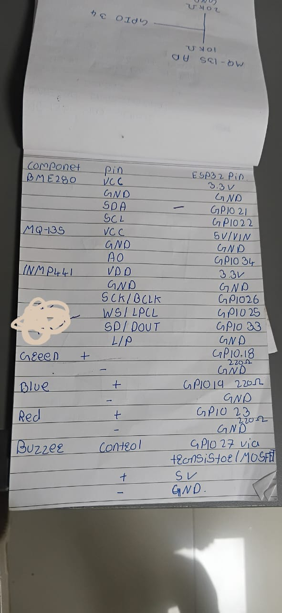

# class-ecosystem

A single ESP32 box that watches one classroom: temperature, humidity, pressure,
relative air quality and noise level. Three LEDs show the room's state at a
glance, a buzzer fires on a gas alert, and the box serves its own web dashboard
over WiFi — no laptop, no server, no cloud.



## What it measures

| Sensor | Reading | Honest limits |
|---|---|---|
| BME280 | temperature, humidity, pressure | accurate, also corrects the gas reading |
| MQ-135 | **relative** air-quality index | not ppm — see below |
| INMP441 | noise level in dB | audio is never recorded |

**The MQ-135 does not report CO₂ in ppm, and this project will not pretend it
does.** It is an uncalibrated resistive sensor that drifts with temperature and
humidity and needs 24–48 h of burn-in. What it *can* do honestly is report how
much worse the air is than a baseline you set yourself with the windows open,
and raise an alarm when that rises sharply.

**No audio leaves the chip.** The microphone's samples become a single loudness
number on the ESP32 and are discarded immediately. Nothing is recorded, stored
or transmitted.

## Indicators

| LED | Meaning |
|---|---|
| Blue blinking | connecting to WiFi |
| Blue solid | running and reachable |
| Green solid | room normal |
| Green blinking | warning — something outside comfort range |
| Red solid | gas alert, buzzer active |
| Red blinking | sensor fault |

## Run the dashboard without hardware

```bash
python3 ui/serve.py          # http://localhost:8000
python3 ui/serve.py --selftest
```

Force any state by adding `?s=warn`, `?s=alert`, `?s=fault`, `?s=nobaseline`
or `?s=boot` to the URL.

## Wiring

See `docs/pinout.jpeg` and the table in
`docs/superpowers/specs/2026-09-19-classroom-ecosystem-design.md`.
MQ-135's analog output runs through a 20k/10k divider because it can reach 5V
and the ESP32's ADC tops out at 3.3V. GPIO34 is on ADC1, which is the only ADC
that works while WiFi is on.

## Status

Dashboard built and verified. Firmware not yet written.
